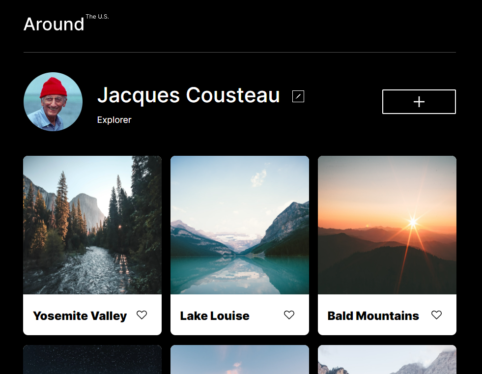
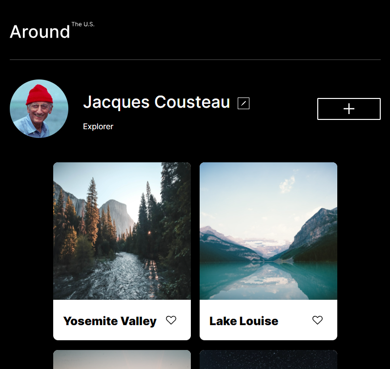
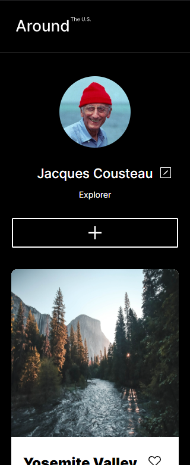

**GitHub Page**

https://g0ld3n-c0de.github.io/se_project_aroundtheus/ <--- Click me to see website :)

# Project 3: Around The U.S.

### Overview

- Intro
- Figma
- Technologies
- Images
- GitHub
- JavaScript

**Intro**

This project depicts a sample profile page with a responsive layout. The website is designed to appear both aesthetically pleasing and logically designed on all screen sizes. Uses JavaScript to render and add cards.

**Figma**

- [Link to the project on Figma](<https://www.figma.com/file/JFPhASqvZ5pBjQV2ouUlim/Sprint-5_-Around-The-U.S.-_-desktop-%2B-mobile-(Copy)?node-id=0-1&t=ias86NNsNuiSfcgs-0>)

**Technologies**

This project utilized Figma, HTML, and CSS. Important techniques include flexbox and grid layout. It also includes to JavaScript to render cards, change profile name and description and add cards.

**Images**

**GitHub Page**

https://g0ld3n-c0de.github.io/se_project_aroundtheus/
